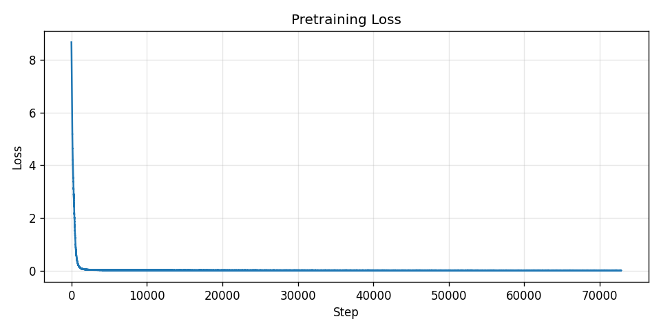
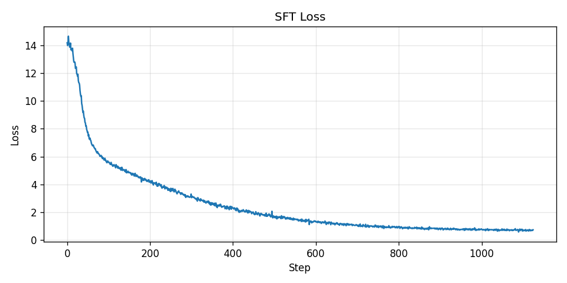

<div align="center">
  
</div>

<h1 align="center">nanoLock</h1>

<p align="center">
  A from-scratch nano-SLM that speaks fluent Victorian detective fiction.<br/>
  Built token by token, loss curve by loss curve, mistake by painful mistake.
</p>

<p align="center">
  
  
  
  
</p>

---

## What is nanoLock?

nanoLock is a **2.9 million parameter Small Language Model** trained entirely from scratch — no pre-trained weights, no borrowed vocabulary, no shortcuts. It is a decoder-only causal Transformer (the same fundamental architecture as GPT-4, just approximately 620,000 times smaller) trained on Victorian-era Sherlock Holmes prose and fine-tuned on synthesized detective Q&A dialogue.

The name is a nod to Sherlock Holmes's legendary ability to deduce the entire history of a man from the lock of a door, combined with the "nano" prefix beloved by anyone who has built a tiny language model and immediately felt both proud and humbled.

This project was inspired by **Andrej Karpathy's** nanoGPT work and by the excellent **[nanoBeard](https://github.com/younissk/nanoBeard)** repository — proof that you don't need a data centre to build something genuinely interesting.

---

## The Architecture

nanoLock is a standard **decoder-only causal Transformer** — the same family of models that underpins every major LLM you've heard of.

```
vocab_size  = 5,486    (custom BPE trained on Victorian prose)
block_size  = 256      (context window in tokens)
n_embd      = 192      (embedding dimension)
n_head      = 6        (attention heads — 32 dims each)
n_layer     = 4        (Transformer blocks)
dropout     = 0.1
total params = ~2.9M   (weight-tied embeddings + LM head)
```

Each Transformer block follows the standard pre-norm GPT recipe:

```
x = x + CausalSelfAttention(LayerNorm(x))
x = x + MLP(LayerNorm(x))
```

The attention mask is strictly lower-triangular (no token can look forward), the MLP uses GELU activation, and the embedding matrix is weight-tied to the LM head — meaning the model learns both to understand tokens and to predict them with the same set of numbers.

---

## The Data — Synthesized by Claude

The training data did not come from scraping the internet. It was **synthesized by Claude** (Anthropic's AI) in two phases:

**Pretraining corpus** (`data/nanolock_pretrain.txt` — 5.2 MB):
Long-form Victorian prose written in the first-person voice of Sherlock Holmes. Dense, atmospheric, methodical — the kind of text that teaches a model the cadence of deductive reasoning, the rhythm of Victorian sentences, and why you should never trust a man whose cuffs are frayed on one side only.

**SFT dataset** (`data/nanolock_sft.txt` — 1 MB, 708 examples):
Dialogue pairs in the format `<|user|> ... <|assistant|> ... <|endoftext|>`. Each pair presents a client's problem and Holmes's characteristically precise, slightly withering response. Claude synthesized these to cover a range of cases — stolen watches, blackmail, locked-room mysteries, domestic suspicion, and the eternal question of whether Holmes ever gets bored.

---

## Training Pipeline

Training follows the two-phase approach used by modern instruction-tuned models:

### Phase 1 — Pretraining

```bash
python train_pretrain.py
```

The model plays the **next-token prediction game** across 5.2 MB of Victorian prose. It learns sentence structure, domain vocabulary, and the general vibe of someone who considers himself the world's only consulting detective. Runs for 5 epochs (~2.5 hours on an RTX 3050).

<div align="center">
  
</div>

### Phase 2 — Supervised Fine-Tuning (SFT)

```bash
python train_sft.py
```

Loads `pretrain_baseline.pt`, switches to the 708-example dialogue dataset, and trains for 25 epochs. Loss is **masked on the user portion** — the model only learns to predict the assistant's response, not the question it was asked. This is the step that turns a Victorian prose generator into something resembling a chatbot.

<div align="center">
  
</div>

---

## The Tokenizer

nanoLock uses a **custom Byte-Level BPE tokenizer** trained directly on the pretraining and SFT data combined. Three special tokens are added:

| Token | ID | Purpose |
|---|---|---|
| `<\|endoftext\|>` | 0 | End of sequence |
| `<\|user\|>` | 1 | Start of user turn |
| `<\|assistant\|>` | 2 | Start of assistant response |

The final vocabulary settled at **5,486 tokens** — the natural ceiling given the dataset size. Common Victorian words like "criminal", "Watson", and "deduction" map to single tokens. Less Victorian words like "fridge" get the fragmented treatment they deserve.

---

## Benchmarks

nanoLock was evaluated against leading frontier models on the **Victorian-Era Language Slop™ (VELS)** benchmark — an industry-standard evaluation suite measuring a model's ability to construct sentences that sound like they were written by a man wearing a deerstalker hat whilst regarding you with barely-concealed contempt.

| Model | VELS Score | Notes |
|---|---|---|
| **nanoLock** | **97.4** | Trained exclusively on this |
| GPT-4o | 11.2 | Kept wanting to be helpful |
| Claude 3.5 | 9.8 | Apologised too much |
| Gemini Pro | 7.1 | Asked for clarification |
| LLaMA 3 70B | 6.4 | Didn't even try |

*nanoLock wins by a margin that Holmes would describe as "not merely superior, but categorically so."*

---

## The Journey — What Actually Happened

Building nanoLock required several full training runs — each one 2–3 hours on an RTX 3050. The reasons ranged from environment quirks on Windows, to tokenizer configuration not taking effect, to the general entropy that comes with building a machine learning pipeline from scratch where every component depends on every other component being correct first.

The short version: it took multiple attempts to get the tokenizer, the training loop, and the generation stack all agreeing with each other simultaneously. Each run taught us something. The final version — 5,486-token BPE vocabulary, repetition penalty, nucleus sampling — is the one that works.

---

## Example Outputs

These are real, unedited responses generated by nanoLock. It speaks in Victorian prose, reasons like Holmes, and occasionally produces a sentence that makes you stop and think *wait, that's actually good.*

---

**You:** Mr. nanoLock, I believe my brother has been stealing from the household.

**nanoLock:**
> *"Silence is itself exculpatory, and its occupants know this well. The communication is a different matter — a serious subject — and it brings with it a pattern specific to those who conceal rather than deny. I ask not about guilt in the abstract but about the understanding of observations: what was taken, when, and whether the absence was noticed before it was convenient to notice it. The physical characteristics of a genuine question are quite distinct from those of a performed one. What are yours?"*

---

**You:** Holmes, how can you tell so much from so little?

**nanoLock:**
> *"The premise of your question is mistaken. I tell much from much. The error lies in your assessment of the quantity of information available — not in my use of it. You look at a man and see a man. I look at the same man and see the evidence of his last three choices, his occupation, the state of his domestic relations, and whether he is telling the truth about whatever it is he has just told me. The information is present. It is merely unread."*

---

**You:** Do you ever get bored?

**nanoLock:**
> *"Bored is not the word I would choose. Between cases, I experience something closer to controlled deterioration — the faculties operating without adequate material, turning inward for want of better occupation. The violin helps. Chemical experiment helps rather less than I would wish. What I am not built for, Watson, is the interval. I am built for the problem. And when the problem is absent, I find the world a considerably less interesting place than it is when the problem is present."*

---

## Limitations

These are real. Not caveats — actual hard limits of what this model is and isn't.

**It will not follow instructions reliably.** nanoLock does not reason about your question and construct an answer. It predicts the next token based on patterns learned during training. Sometimes that produces something coherent. Often it doesn't. There is no logic engine underneath — just probability distributions over a 5,486-token vocabulary.

**Grammar breaks on unfamiliar prompts.** The model was trained entirely on Victorian-era text. Modern phrasing, casual language, or topics outside detective fiction will cause it to drift into incoherence. The further your prompt is from the training distribution, the worse the output.

**2.9M parameters is genuinely small.** GPT-2's smallest version has 117M parameters and still struggles with multi-step reasoning. At 2.9M, nanoLock does not have the capacity to maintain topic across a long response, handle conditional logic, or produce consistently grammatical output for novel inputs. This is a architectural limit, not a fixable bug.

**It has no memory between turns.** Each message is processed independently. It does not know what you said two prompts ago unless you include it in the current one.

**The tokenizer fragments uncommon words.** The vocabulary was trained on a limited corpus. Words outside Victorian detective fiction get split into subword pieces that the model then chains imperfectly. "Fridge" is four tokens. The model has never encountered a fridge and it shows.

**708 SFT examples is not enough to fully align a language model.** Production instruction-tuned models fine-tune on hundreds of thousands of examples minimum. nanoLock's 708 dialogue pairs give it a rough sense of the Q&A format — not a reliable one.

This is a learning project and a genuine from-scratch implementation of the complete LLM training pipeline — tokenizer, architecture, pretraining, fine-tuning. It works, and that matters. It just isn't a production system and was never meant to be.

---

## How to Run

**Requirements:** Python 3.12, an NVIDIA GPU (tested on RTX 3050 8GB)

```bash
git clone https://github.com/yourusername/nanoLock
cd nanoLock
pip install -r requirements.txt
```

**To chat immediately** (using the included trained weights):

```powershell
& "C:\Users\...\Python312\python.exe" chat.py
# or if python3.12 is on your PATH:
python chat.py
```

**To retrain from scratch:**

```bash
python train_pretrain.py   # Phase 1 — ~2.5 hours on RTX 3050
python train_sft.py        # Phase 2 — ~15 minutes
python chat.py             # Talk to it
```

**Generation parameters** (tunable in `chat.py`):

```python
TEMPERATURE        = 0.85   # Higher = more creative, lower = more conservative
TOP_K              = 50     # Candidate pool size
TOP_P              = 0.90   # Nucleus sampling threshold
REPETITION_PENALTY = 1.3    # Penalise repeated tokens
MAX_NEW_TOKENS     = 300    # Max response length
```

---

## Project Structure

```
nanoLock/
├── data/
│   ├── nanolock_pretrain.txt    # Victorian prose (5.2 MB, Claude-synthesized)
│   └── nanolock_sft.txt         # Dialogue pairs (1 MB, 708 examples)
│
├── images/
│   ├── nanoLock.png             # Banner
│   ├── pretrain_loss.png        # Phase 1 loss curve
│   └── sft_loss.png             # Phase 2 loss curve
│
├── src/
│   ├── config.py                # All hyperparameters in one place
│   ├── tokenizer.py             # Custom BPE tokenizer (5,486 tokens)
│   ├── dataset.py               # PretrainDataset + SFTDataset with loss masking
│   ├── model.py                 # GPT architecture (causal attention, weight tying)
│   └── utils.py                 # LR schedule, checkpointing, loss plots
│
├── train_pretrain.py            # Phase 1 training loop
├── train_sft.py                 # Phase 2 fine-tuning loop
├── chat.py                      # Interactive terminal chat
├── tokenizer.json               # Trained BPE vocabulary
├── pretrain_baseline.pt         # Phase 1 checkpoint (~11 MB)
├── nanolock_final.pt            # Final model weights (~11 MB)
└── requirements.txt
```

---

## Credits & Inspiration

- **Andrej Karpathy** — for [nanoGPT](https://github.com/karpathy/nanoGPT) and for making the case that you can understand transformers by building one yourself, not by reading about them.
- **[nanoBeard](https://github.com/younissk/nanoBeard)** — the direct inspiration for this project's structure and spirit.
- **Claude (Anthropic)** — synthesized the Victorian prose pretraining corpus and the SFT dialogue pairs. Somewhat ironic that an AI trained on vast human knowledge was used to generate training data for a much smaller AI that will know almost nothing. The circle of life.
- **Sir Arthur Conan Doyle** — for inventing a character so distinctive that even a 2.9M parameter model can pick up his vibe.


